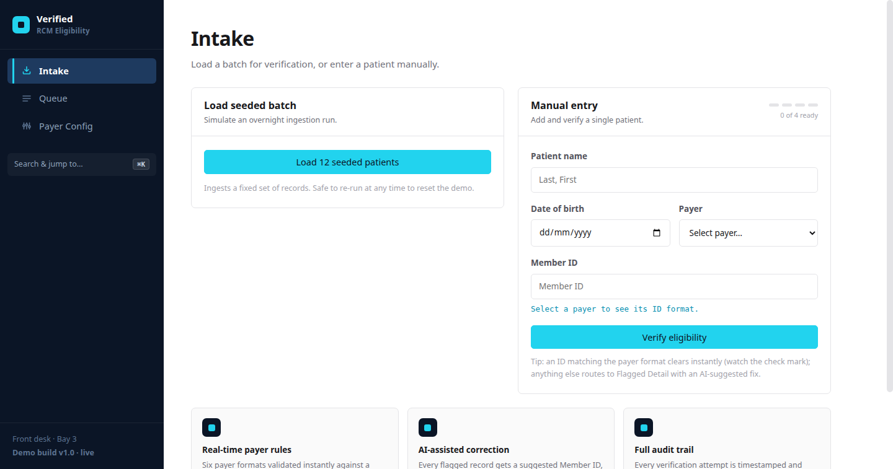
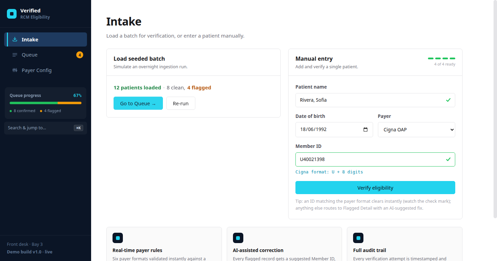
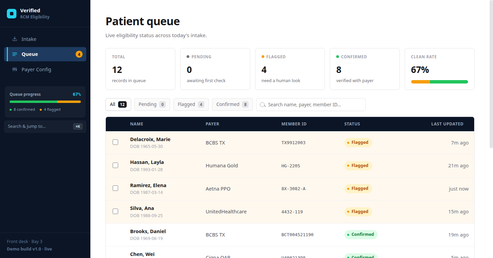
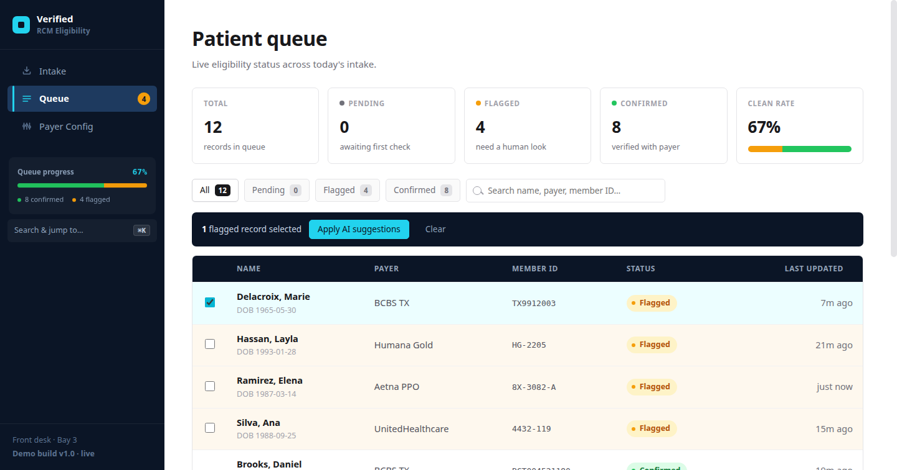
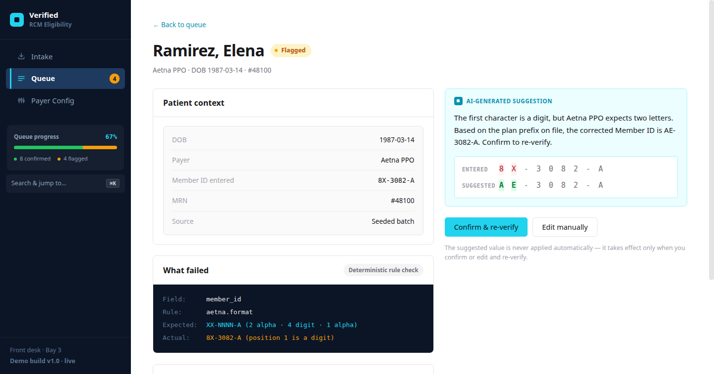
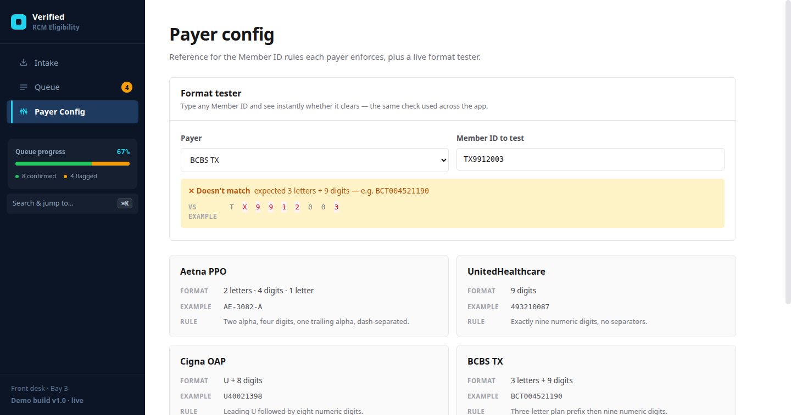
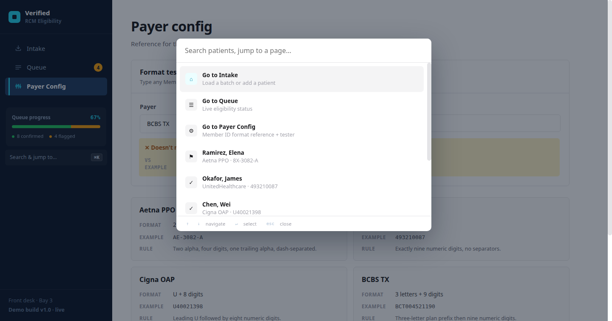

<div align="center">

# 🩺 Verified — RCM Eligibility

### AI-assisted patient eligibility verification for front-desk teams

*Catch bad Member IDs before the claim does. Fix them in seconds, not phone calls.*

[](#-tech-stack)
[](#-getting-started)
[](#-tech-stack)
[](#-getting-started)

</div>

---

## 📖 Table of Contents

1. [The Problem](#-the-problem)
2. [What We Built](#-what-we-built)
3. [Feature Tour](#-feature-tour)
4. [What Makes This Novel](#-what-makes-this-novel)
5. [Design System](#-design-system)
6. [Tech Stack & Architecture](#-tech-stack--architecture)
7. [Project Structure](#-project-structure)
8. [Getting Started](#-getting-started)
9. [Judge's Demo Script](#-judges-demo-script)
10. [Payer Rule Reference](#-payer-rule-reference)
11. [Roadmap](#-roadmap)
12. [Credits](#-credits)

---

## 🎯 The Problem

Revenue Cycle Management (RCM) teams verify patient insurance eligibility **before** a claim goes out. A huge chunk of denials trace back to one thing: a **mistyped or malformed Member ID**. Today that means:

- 📞 A front-desk staffer manually calling the payer to double-check
- 🐌 Claims sitting in limbo for a human to notice something's off
- 🤷 No visibility into *why* a record failed, or what the correct value should be
- 🗂️ No audit trail proving what was checked, when, and by whom

**Verified** turns that into a real-time, self-service workflow: ingest patients, catch format violations instantly with a deterministic rule engine, show the front-desk exactly *what's wrong* and an *AI-suggested fix* with a character-level diff, and let them confirm-and-reverify in one click — fully audited.

---

## 🚀 What We Built

A complete, **single-page eligibility dashboard** — three real workflows (not wireframes), a working rule engine for six payers, live diff-based correction suggestions, bulk resolution, a command palette, and a live progress-tracking sidebar. Every interaction is real: nothing is a static mockup.

| | |
|---|---|
| 🖥️ **3 core views** | Intake · Patient Queue · Flagged Detail (+ Payer Config reference) |
| 🏥 **6 payer formats** | Aetna PPO, UnitedHealthcare, Cigna OAP, BCBS TX, Humana Gold, Kaiser — each with its own regex rule |
| 🧠 **AI-style correction** | Every flagged record gets a suggested fix with an inline character-level diff |
| ⌨️ **Command palette** | `⌘K` / `Ctrl+K` fuzzy-jumps between pages and patients |
| 📊 **Live sidebar progress** | Real-time confirmed/flagged/pending composition, computed from actual state |
| ⚡ **Zero build step** | Open `index.html`. That's the whole deploy story. |

---

## ✨ Feature Tour

### 1. Intake — load a batch, or add a patient live



- **Load 12 seeded patients** simulates an overnight payer ingestion run (8 clean, 4 flagged) — safe to re-run any time to reset the demo.
- **Manual entry** validates as you type: a 4-dot progress meter tracks Name → DOB → Payer → Member ID, and the Member ID field gets a live ✅ / ⚠️ indicator the instant it matches (or fails) the selected payer's format — no need to hit submit to find out.



### 2. Patient Queue — sortable, searchable, bulk-actionable



- **Stat band** — total, pending, flagged, confirmed, and a live clean-rate % with a composition bar, all computed from the actual patient list.
- **Sortable columns**, **status filter chips**, and an **instant search box** across name / payer / Member ID.
- **Bulk resolve**: tick multiple flagged rows and apply every AI suggestion in one click.



### 3. Flagged Detail — see exactly what broke, and fix it



- **What failed** — a deterministic, terminal-style breakdown: field, rule, expected format, actual value.
- **Character-level diff** — entered vs. suggested Member ID rendered character-by-character, red strikethrough for what's wrong, green for the fix. No guessing what changed.
- **Audit trail** — every verification attempt (pass or fail) is timestamped and kept with the record.
- **Confirm & re-verify** re-runs the same rule engine live — the suggestion is *never* auto-applied, only on explicit confirm or manual edit.

### 4. Payer Config — the rulebook, with a live tester



- Reference cards for all 6 payer formats (pattern, example, plain-English rule).
- **Format tester**: type any Member ID against any payer and get an instant pass/fail — with the same character-diff treatment against the payer's example when it fails. This is the exact rule engine the rest of the app uses, exposed for experimentation.

### 5. Command Palette — `⌘K` anywhere



- Jump to any page or any patient by name, payer, or Member ID.
- Selecting a flagged patient opens their resolution view; selecting a clean one opens the read-only drawer.
- Full keyboard nav: `↑` `↓` to move, `↵` to select, `Esc` to close.

### 6. Live Sidebar

- Icon-driven navigation (no placeholder shapes) with an active-state cyan accent bar.
- **Queue progress widget** appears the moment a batch loads: a live confirmed/flagged/pending bar and % clean rate.
- The Queue nav badge **pulses** while flagged records are outstanding — an ambient "something needs you" signal.

---

## 💡 What Makes This Novel

Built for a hackathon setting, so every "extra" here demos something real off data already in the app — nothing is bolted on for show:

- **Character-level diffs**, not just "here's a suggestion." You can *see* the single wrong character, the same way a human proofreader would.
- **Bulk resolve** turns a queue of one-at-a-time fixes into a single action — genuinely useful at scale.
- **Live format tester** doubles as documentation *and* a sandbox — payers can be understood by playing with them, not just reading a table.
- **Command palette** makes the whole app keyboard-navigable in a domain (healthcare ops) that's usually mouse-heavy and slow.
- **Real audit trail**, not a static timestamp — every attempt, pass or fail, is logged against the record as it happens.
- **Focus-preserving render loop** (see [Architecture](#-tech-stack--architecture)) — the whole UI re-renders from a single state object on every change, yet you never lose your place typing in a field. That's a deliberately hard problem for a from-scratch renderer, solved without a framework.

---

## 🎨 Design System

The interface follows a **strict, intentionally small palette** — easy to scan under time pressure, which matters in a clinical front-desk setting.

| Role | Color | Usage |
|---|---|---|
| 🌑 Navy `#0B1526` / `#1E3A5F` / `#3B5372` | Structure | Sidebar, table headers, drawer/modal chrome |
| 🩵 Cyan `#0891B2` / `#22D3EE` / `#ECFEFF` | **The single accent** | Primary buttons, active nav, focus rings — cyan-50 tint appears in exactly one place: the AI-suggestion card |
| ⚪ Zinc `#FAFAFA → #18181B` | Neutral base | Canvas, borders, body text |

**Status system** — held completely separate from the accent palette, and never mixed with cyan:

| Status | Meaning |
|---|---|
| 🔘 **Pending** (`#71717A`) | Awaiting first eligibility check |
| 🟠 **Flagged** (`#F59E0B`) | Routine format mismatch — needs a human, **not** an error |
| 🟢 **Confirmed** (`#22C55E`) | Verified with the payer |

> Amber is for routine mismatches. Red is reserved for hard failures only, and never appears as a status pill — only as an inline banner for genuine dead-ends.

**Typography** — Inter throughout, deliberately sized up from the original spec for front-desk legibility at a glance:

| Element | Size / Weight |
|---|---|
| Page title | 32px / 700 |
| Section heading | 20px / 600 |
| Table row | 14.5px / 600 |
| Body / suggestion prose | 15px / 400, 1.65 line-height |
| Hint / micro text | 12.5px – 11.5px |

---

## 🛠 Tech Stack & Architecture

**Zero dependencies. Zero build step. ~1,400 lines, hand-written.**

| Layer | Choice | Why |
|---|---|---|
| Rendering | Vanilla JS, full-tree re-render from one `state` object | No framework overhead; the entire app is `state → HTML string → innerHTML` |
| Focus handling | Custom focus-preserving render loop | Captures `document.activeElement` + selection range before every re-render, restores it after — so typing never stutters despite full-DOM rebuilds |
| Events | Single delegated listener per event type on the root node | No per-element listener wiring/cleanup; `data-action` attributes route clicks to a plain `Actions` map |
| Styling | Hand-written CSS custom properties (design tokens) | No Tailwind/CSS-in-JS — the whole visual language is ~25 CSS variables |
| Diffing | Hand-rolled LCS character diff (`charDiff`) | Powers both the Flagged Detail suggestion view and the Payer Config tester |
| Fonts | Inter + JetBrains Mono via Google Fonts, with system-font fallback stacks | Graceful on a flaky conference-wifi demo |

```
State change → setState() → render()
                                │
                    ┌───────────┴───────────┐
                    │ capture focused input  │
                    │ + cursor position      │
                    └───────────┬───────────┘
                                ▼
                    root.innerHTML = App()   ← one big template string
                                │
                    ┌───────────┴───────────┐
                    │ restore focus + cursor │
                    └────────────────────────┘
```

This pattern was chosen deliberately: it's the simplest mental model that still supports a fully interactive multi-view app — one state object, one render function, no virtual DOM, no reconciliation — while solving the one real gotcha (focus loss) that naive full-rerender approaches usually get wrong.

---

## 📁 Project Structure

```
Elgicheck/
├── index.html                    # Shell — loads fonts, styles.css, app.js
├── styles.css                    # Design tokens + every component style (~370 lines)
├── app.js                        # Entire application: data, state, render, logic (~1040 lines)
├── README.md                     # You are here
└── assets/
    └── screenshots/               # Captured via headless-Chrome + CDP for this README
```

No `node_modules`, no `package.json`, no bundler config — the three files above are the entire deployable artifact.

---

## ▶️ Getting Started

**Option 1 — just open it:**

```bash
open index.html        # macOS
xdg-open index.html    # Linux
start index.html       # Windows
```

**Option 2 — serve it (recommended for consistent relative-path behavior):**

```bash
cd Elgicheck
python3 -m http.server 8731
# then visit http://localhost:8731
```

No install step, no `npm install`, no build. It's three static files.

---

## 🎬 Judge's Demo Script

A 90-second walkthrough that hits every feature:

1. **Intake →** click *"Load 12 seeded patients"* — watch the ingest spinner, then the "8 clean, 4 flagged" summary.
2. **→ Go to Queue** — point out the live stat band and composition bar (67% clean rate).
3. Click a **flagged row** (e.g. *Ramirez, Elena*) → watch the AI suggestion load, then the **character diff**: `8X-3082-A` → `AE-3082-A`, with the wrong `8X` struck through in red and the corrected `AE` in green.
4. Click **Confirm & re-verify** — watch the re-verify spinner, the pass banner, and the row **flash green** back in the Queue.
5. Back in Queue, **tick two flagged checkboxes** → the bulk bar appears → **Apply AI suggestions** clears both in one click.
6. Hit **`⌘K`**, type a patient's name, jump straight to their record.
7. Go to **Payer Config**, pick a payer, type a bad ID into the **live tester** — watch it fail with the same diff treatment; fix one character and watch it flip to a pass in real time.
8. Glance at the **sidebar** the whole time — the progress bar and flagged badge update live with everything you just did.

---

## 📋 Payer Rule Reference

| Payer | Format | Example |
|---|---|---|
| Aetna PPO | 2 letters · 4 digits · 1 letter | `AE-3082-A` |
| UnitedHealthcare | 9 digits | `493210087` |
| Cigna OAP | `U` + 8 digits | `U40021398` |
| BCBS TX | 3 letters + 9 digits | `BCT004521190` |
| Humana Gold | `H` + 8 digits | `H55830921` |
| Kaiser | 10 digits | `6120094475` |

Every seeded "flagged" demo record was hand-verified to have a suggested correction that **actually passes** its payer's regex — so the happy-path demo (steps 3–4 above) is guaranteed to work, not just usually work.

---

## 🗺 Roadmap

- [ ] CSV export of the resolved queue
- [ ] Per-payer confidence scoring on suggestions (not just pass/fail)
- [ ] Persisted state (localStorage) so a demo survives a refresh
- [ ] Dark mode
- [ ] Real payer API integration behind the same rule-engine interface

---

## 🙌 Credits

Built end-to-end — design tokens, all four views, the diff engine, and the render loop — as a from-scratch vanilla JS implementation, no UI framework, no component library.

<div align="center">

**Verified** · RCM Eligibility · Demo build v1.0

</div>
